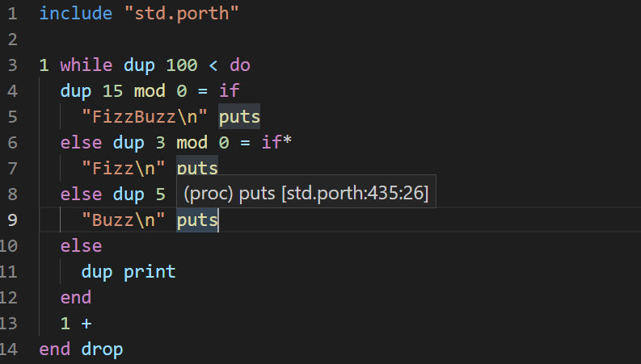

# Porth language for VSCode

GitHub repository: [Porth language extension for VSCode](https://github.com/timholzhey/porth-language)

## Features

This is a Visual Studio Code extension created by Tim Holzhey to add Porth language support.

[Porth](https://gitlab.com/tsoding/porth) is an imperative, stack-based programming language.
Porth is open-source and is currently being developed by [Alexey Kutepov](https://github.com/rexim) aka [Tsoding](https://www.youtube.com/c/Tsoding).

Features:
- Syntax highlighting (Grammar set)
- Code snippets (Intrinsics and code blocks)
- Bootstrap, compile and run commands
- Integrated Porth compiler (submodule)
- Jump to definition (`CTRL+LEFTCLICK`)

## Usage

1. Open a `.porth` file
2. Open the Command Pallet (`CTRL+SHIFT+P` for Windows/Linux or `CMD+SHIFT+P` on Mac) and enter one of the supported commands:
    - Porth: Bootstrap compiler
    - Porth: Compile program
    - Porth: Run program

Make sure you have all required commands (python3, nasm, ld) added to `$PATH`.

## Settings

- `porth.path`: Path to the porth compiler (default: builtin)
- `porth.debug`: Compiler debug flag (default: off)
- `porth.auto-run`: Auto run the program after compiling (default: on)

## Work in progress

Future features:

- Test programs
- Syntax error diagnostics
- Autocomplete suggestions
- Parse definitions from all included files, not just stdlib
- Proper bootstrapping

## Requirements

### Linux x86 compiling

- flat assembler ([FASM](https://flatassembler.net/download.php)) for Linux

### Windows 10 (WSL) x86 compiling

- Windows Subsystem for Linux (WSL), install with: `wsl --install`
- Download flat assembler ([FASM](https://flatassembler.net/download.php)) for Linux
- Unzip and move the fasm folder to a reasonable location
- Remove file `fasm` and rename `fasm.x64` to `fasm`
- Add FASM to `$PATH` and restart
